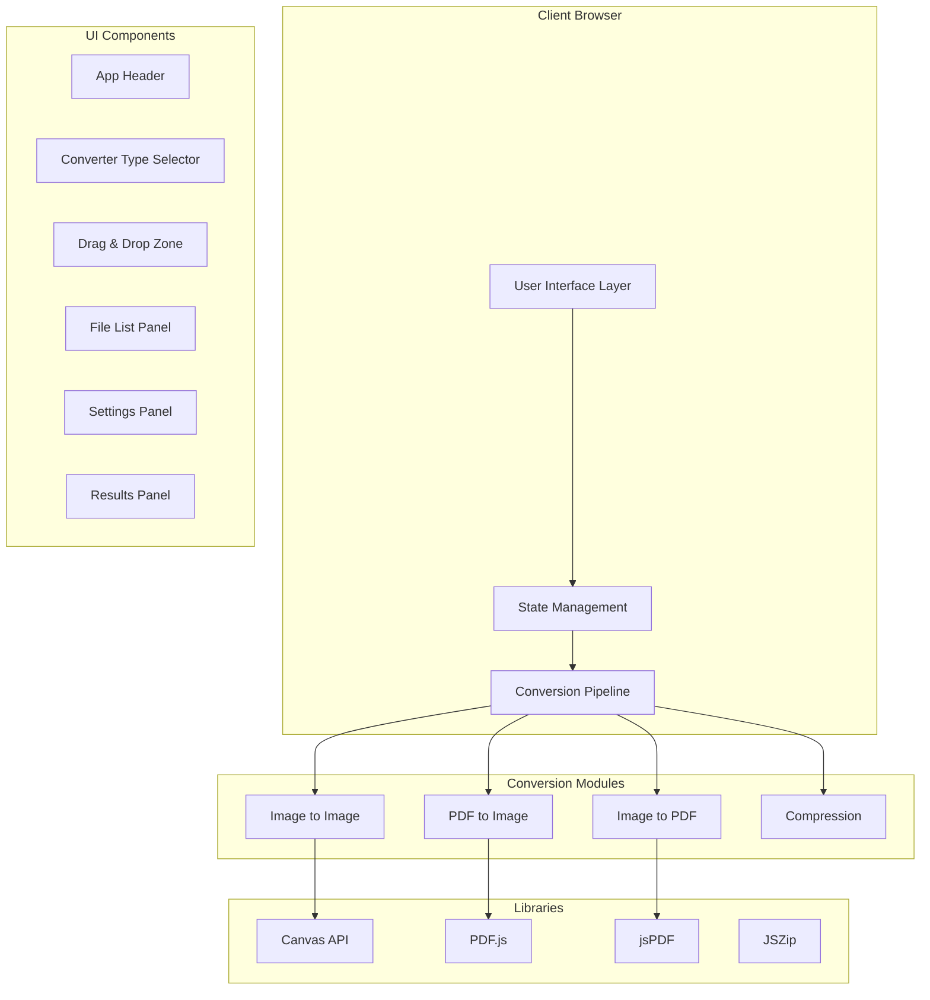

# File Converter Web App - Specification Document

## 1. Project Overview

**Project Name:** File Converter  
**Project Type:** Web Application (Static/Client-side Only)  
**Core Functionality:** Browser-based file conversion tool supporting image-to-image, image-to-PDF, and PDF-to-image conversions with bulk processing capabilities.  
**Target Users:** General users needing quick file conversions without installing software or uploading to third-party servers.

---

## 2. Technical Architecture

### 2.1 Technology Stack

| Category | Technology |
|----------|------------|
| Framework | Next.js 14 (App Router) |
| Language | TypeScript |
| Styling | CSS Modules + CSS Variables |
| PDF Rendering | pdfjs-dist |
| PDF Generation | jspdf |
| ZIP Creation | jszip |
| Image Compression | browser-image-compression |
| Deployment | Vercel (Static Export) |

### 2.2 Architecture Diagram



### 2.3 Project Structure

```
file-converter/
├── app/
│   ├── layout.tsx
│   ├── page.tsx
│   ├── globals.css
│   └── favicon.ico
├── components/
│   ├── Header/
│   │   ├── Header.tsx
│   │   └── Header.module.css
│   ├── ConverterSelector/
│   │   ├── ConverterSelector.tsx
│   │   └── ConverterSelector.module.css
│   ├── Dropzone/
│   │   ├── Dropzone.tsx
│   │   └── Dropzone.module.css
│   ├── FileList/
│   │   ├── FileList.tsx
│   │   ├── FileItem.tsx
│   │   └── FileList.module.css
│   ├── SettingsPanel/
│   │   ├── SettingsPanel.tsx
│   │   ├── ImageSettings.tsx
│   │   ├── PdfSettings.tsx
│   │   └── SettingsPanel.module.css
│   ├── ResultsPanel/
│   │   ├── ResultsPanel.tsx
│   │   ├── ResultItem.tsx
│   │   └── ResultsPanel.module.css
│   └── ConvertButton/
│       ├── ConvertButton.tsx
│       └── ConvertButton.module.css
├── lib/
│   ├── imageConverter.ts
│   ├── pdfConverter.ts
│   ├── imageToPdf.ts
│   ├── zipHelper.ts
│   ├── fileHelpers.ts
│   └── types.ts
├── hooks/
│   ├── useConversion.ts
│   └── useFileQueue.ts
├── public/
│   └── (static assets)
├── package.json
├── next.config.js
└── tsconfig.json
```

---

## 3. UI/UX Specification

### 3.1 Layout Structure

```
┌─────────────────────────────────────────────────────────────┐
│  Header: Logo + Title                                       │
├─────────────────────────────────────────────────────────────┤
│  Converter Type Selector [IMG→IMG | IMG→PDF | PDF→IMG]     │
├─────────────────────────────────────────────────────────────┤
│                                                             │
│  ┌─────────────────────────────────────────────────────┐   │
│  │           Dropzone (Drag & Drop Area)                │   │
│  │         Click or drag files to upload               │   │
│  └─────────────────────────────────────────────────────┘   │
│                                                             │
├─────────────────────────────────────────────────────────────┤
│  Settings Panel (contextual based on converter type)       │
│  - Output format, Quality, Resize options                   │
├─────────────────────────────────────────────────────────────┤
│  [ Convert Button ]                                         │
├─────────────────────────────────────────────────────────────┤
│  File List Panel                                            │
│  ┌─────────────────────────────────────────────────────┐    │
│  │ thumb │ filename.jpg    │ 2.4 MB   │    ✕         │    │
│  │ thumb │ document.pdf    │ 1.1 MB   │    ✕         │    │
│  └─────────────────────────────────────────────────────┘    │
├─────────────────────────────────────────────────────────────┤
│  Results Panel                                              │
│  ┌─────────────────────────────────────────────────────┐    │
│  │ thumb │ converted.png  │ 800 KB │ [Download]      │    │
│  │ thumb │ page_001.png   │ 120 KB │ [Download]      │    │
│  └─────────────────────────────────────────────────────┘    │
│  [ Download All as ZIP ]                                    │
└─────────────────────────────────────────────────────────────┘
```

### 3.2 Responsive Breakpoints

| Breakpoint | Width | Layout Adjustments |
|------------|-------|-------------------|
| Mobile | < 640px | Single column, stacked panels |
| Tablet | 640px - 1024px | Two-column where appropriate |
| Desktop | > 1024px | Full layout with side panels |

### 3.3 Color Palette

```css
:root {
  /* Primary Colors */
  --color-primary: #6366f1;
  --color-primary-hover: #4f46e5;
  --color-primary-light: #e0e7ff;
  
  /* Secondary Colors */
  --color-secondary: #10b981;
  --color-secondary-hover: #059669;
  
  /* Neutral Colors */
  --color-bg: #f8fafc;
  --color-surface: #ffffff;
  --color-border: #e2e8f0;
  --color-text: #1e293b;
  --color-text-muted: #64748b;
  
  /* Status Colors */
  --color-success: #22c55e;
  --color-warning: #f59e0b;
  --color-error: #ef4444;
  --color-info: #3b82f6;
  
  /* Shadows */
  --shadow-sm: 0 1px 2px rgba(0, 0, 0, 0.05);
  --shadow-md: 0 4px 6px -1px rgba(0, 0, 0, 0.1);
  --shadow-lg: 0 10px 15px -3px rgba(0, 0, 0, 0.1);
}
```

### 3.4 Typography

```css
:root {
  /* Font Family */
  --font-sans: 'Inter', -apple-system, BlinkMacSystemFont, 'Segoe UI', Roboto, sans-serif;
  
  /* Font Sizes */
  --text-xs: 0.75rem;    /* 12px */
  --text-sm: 0.875rem;   /* 14px */
  --text-base: 1rem;     /* 16px */
  --text-lg: 1.125rem;   /* 18px */
  --text-xl: 1.25rem;    /* 20px */
  --text-2xl: 1.5rem;    /* 24px */
  --text-3xl: 1.875rem;  /* 30px */
  
  /* Font Weights */
  --font-normal: 400;
  --font-medium: 500;
  --font-semibold: 600;
  --font-bold: 700;
}
```

### 3.5 Spacing System

```css
:root {
  --space-1: 0.25rem;   /* 4px */
  --space-2: 0.5rem;    /* 8px */
  --space-3: 0.75rem;   /* 12px */
  --space-4: 1rem;      /* 16px */
  --space-5: 1.25rem;   /* 20px */
  --space-6: 1.5rem;    /* 24px */
  --space-8: 2rem;      /* 32px */
  --space-10: 2.5rem;   /* 40px */
  --space-12: 3rem;     /* 48px */
}
```

---

## 4. Component Specifications

### 4.1 Converter Type Selector

**Purpose:** Allow users to select the conversion type.

**Options:**
- Image to PNG/JPG/WebP
- Image to PDF
- PDF to Image

**Behavior:**
- Single selection (radio-style)
- Changes settings panel content
- Clears file list when switching (with confirmation)

### 4.2 Dropzone Component

**Purpose:** Handle file uploads via drag-and-drop and click.

**Features:**
- Visual feedback on drag-over (border color change, background)
- Accept multiple files
- File type filtering based on selected converter
- Show rejected files with reason
- Display upload progress

**Supported File Types by Converter:**

| Converter | Accepted Types |
|-----------|---------------|
| Image to IMG | image/png, image/jpeg, image/webp, image/gif |
| Image to PDF | image/png, image/jpeg, image/webp, image/gif |
| PDF to IMG | application/pdf |

### 4.3 File List Panel

**Purpose:** Display uploaded files with preview and management options.

**File Item Display:**
- Thumbnail (for images) or PDF icon
- Filename (truncated if too long)
- File size (formatted: KB/MB)
- Remove button (X)
- Conversion status (pending/processing/complete/error)

**Features:**
- Remove individual files
- Clear all files
- Show total count and size
- Sort by name/size/date

### 4.4 Settings Panel

**Purpose:** Configure conversion options.

**Settings by Converter Type:**

#### Image to Image Settings
| Setting | Type | Options/Range |
|---------|------|---------------|
| Output Format | Select | PNG, JPEG, WebP |
| Quality | Slider | 0.1 - 1.0 (default: 0.9) |
| Resize Mode | Select | Keep Original, Scale %, Max Width/Height |
| Scale Value | Number | 10% - 200% |
| Max Width | Number | 100 - 10000 px |
| Max Height | Number | 100 - 10000 px |
| Preserve Metadata | Toggle | On/Off |

#### Image to PDF Settings
| Setting | Type | Options/Range |
|---------|------|---------------|
| Page Size | Select | A4, Letter, Auto |
| Orientation | Select | Portrait, Landscape |
| Margin | Select | None, Small, Medium, Large |
| Images Per Page | Select | 1, 2, 4 |

#### PDF to Image Settings
| Setting | Type | Options/Range |
|---------|------|---------------|
| Output Format | Select | PNG, JPEG |
| Quality | Slider | 0.1 - 1.0 (default: 0.9) |
| Scale | Select | 1x, 2x, 3x, Custom |
| Page Range | Select | All, Custom |
| Custom Pages | Text Input | e.g., "1,3-5" |

### 4.5 Results Panel

**Purpose:** Display converted files with download options.

**Result Item Display:**
- Thumbnail preview
- Original filename → Converted filename
- Output size and savings percentage
- Individual download button

**Features:**
- Individual file download
- Download all as ZIP
- Copy to clipboard (for single files)
- Clear results

---

## 5. Conversion Logic Specifications

### 5.1 Image to PNG/JPG/WebP

**Pipeline:**
```
1. Read file as File object
2. Create ImageBitmap or HTMLImageElement
3. Create offscreen canvas with target dimensions
4. Draw image to canvas
5. Export using canvas.toBlob(type, quality)
6. Create download link from blob
7. Revoke object URLs when done
```

**Memory Management:**
- Use createImageBitmap for better memory handling
- Revoke object URLs immediately after use
- Process files sequentially for large batches

**Transparency Handling:**
- Warn user when converting transparent PNG to JPEG
- Auto-convert transparency to white background for JPEG

### 5.2 Image to PDF

**Pipeline:**
```
1. Read each image file
2. Create jsPDF document
3. Calculate page dimensions based on settings
4. Add image to page (fit or fill)
5. Add new page for each subsequent image
6. Export PDF blob
7. Generate download link
```

**Page Sizing:**
- A4: 210 × 297 mm
- Letter: 8.5 × 11 in
- Auto: Match first image dimensions

### 5.3 PDF to Image

**Pipeline:**
```
1. Read PDF as ArrayBuffer
2. Load document with PDF.js
3. For each page (respecting page range):
   a. Render page to canvas at chosen scale
   b. Convert canvas to PNG/JPG blob
   c. Store result
4. Create ZIP if multiple pages
5. Generate download link(s)
```

**Rendering:**
- Use pdfjs-dist for PDF parsing
- Render to hidden canvas element
- Use requestAnimationFrame for UI responsiveness

---

## 6. Bulk Conversion & ZIP

### 6.1 Concurrency Management

```typescript
const CONCURRENCY_LIMIT = 2; // Process 2 files at a time

async function processQueue(files: File[], converter: Converter) {
  const results: Blob[] = [];
  const queue = [...files];
  
  while (queue.length > 0) {
    const batch = queue.splice(0, CONCURRENCY_LIMIT);
    const batchResults = await Promise.all(
      batch.map(file => converter(file))
    );
    results.push(...batchResults);
  }
  
  return results;
}
```

### 6.2 ZIP Naming Conventions

| Conversion Type | Filename Pattern |
|-----------------|------------------|
| Single image | `originalName_converted.ext` |
| Multiple images | `converted_images.zip` |
| PDF pages | `filename_page_001.png` |
| PDF to ZIP | `filename_pages.zip` |

---

## 7. Performance & Limits

### 7.1 File Size Limits

| File Type | Recommended Limit | Hard Limit |
|-----------|------------------|------------|
| Images | 10 MB | 50 MB |
| PDFs | 10 MB | 25 MB |

### 7.2 Memory Management Rules

1. **Object URL Lifecycle:**
   - Create with `URL.createObjectURL()`
   - Revoke with `URL.revokeObjectURL()` after download or 30 seconds

2. **Canvas Cleanup:**
   - Nullify canvas context after each conversion
   - Remove canvas from DOM if dynamically created

3. **PDF.js Cleanup:**
   - Destroy document object after processing
   - Clear page cache between documents

### 7.3 UI Responsiveness

- Use Web Workers for heavy computations (optional)
- Implement progress indicators for all operations
- Allow cancellation of in-progress conversions
- Show estimated time remaining for bulk operations

---

## 8. State Management

### 8.1 Application State

```typescript
interface AppState {
  // Converter
  converterType: 'image-to-image' | 'image-to-pdf' | 'pdf-to-image';
  
  // Files
  files: FileItem[];
  results: ResultItem[];
  
  // Settings
  settings: ConversionSettings;
  
  // UI State
  isConverting: boolean;
  progress: number;
  error: string | null;
}

interface FileItem {
  id: string;
  file: File;
  previewUrl: string;
  status: 'pending' | 'processing' | 'complete' | 'error';
  error?: string;
}

interface ResultItem {
  id: string;
  originalFile: File;
  outputBlob: Blob;
  outputFilename: string;
  outputSize: number;
  previewUrl: string;
}

interface ConversionSettings {
  // Image to Image
  outputFormat: 'png' | 'jpeg' | 'webp';
  quality: number;
  resizeMode: 'none' | 'scale' | 'max';
  resizeValue: number;
  
  // Image to PDF
  pageSize: 'a4' | 'letter' | 'auto';
  orientation: 'portrait' | 'landscape';
  margin: 'none' | 'small' | 'medium' | 'large';
  
  // PDF to Image
  scale: number;
  pageRange: 'all' | 'custom';
  customPages?: string;
}
```

---

## 9. Error Handling

### 9.1 Error Types

| Error | Handling |
|-------|----------|
| Invalid file type | Show warning, reject file |
| File too large | Show error with size limit |
| Conversion failed | Show error, allow retry |
| Memory exceeded | Show warning, suggest smaller files |
| PDF password protected | Show error, cannot process |

### 9.2 User Feedback

- Toast notifications for success/error
- Inline error messages on file items
- Progress bars for conversion status
- Confirmation dialogs for destructive actions

---

## 10. Deployment Configuration

### 10.1 Next.js Config (Static Export)

```javascript
// next.config.js
module.exports = {
  output: 'export',
  images: {
    unoptimized: true,
  },
  // Disable server-side features for static export
  trailingSlash: true,
}
```

### 10.2 Vercel Deployment

1. Push code to GitHub repository
2. Import project in Vercel
3. Build command: `next build`
4. Output directory: `out`
5. Deploy automatically on push

---

## 11. Acceptance Criteria

### 11.1 Core Functionality
- [ ] User can select converter type (IMG→IMG, IMG→PDF, PDF→IMG)
- [ ] User can drag and drop files or click to upload
- [ ] User can configure conversion settings
- [ ] Conversion completes successfully for valid files
- [ ] User can download individual converted files
- [ ] User can download all files as ZIP

### 11.2 Image to Image
- [ ] Converts PNG to JPEG with quality setting
- [ ] Converts JPEG to WebP with compression
- [ ] Converts PNG to PNG (no quality needed)
- [ ] Resize functionality works correctly
- [ ] Transparency warning shown for PNG→JPEG

### 11.3 Image to PDF
- [ ] Single image creates single-page PDF
- [ ] Multiple images create multi-page PDF
- [ ] Page size settings work (A4, Letter, Auto)
- [ ] Orientation settings work

### 11.4 PDF to Image
- [ ] PDF pages render to images
- [ ] Scale settings work (1x, 2x, 3x)
- [ ] Page range selection works
- [ ] Multiple pages download as ZIP

### 11.5 Performance
- [ ] UI remains responsive during conversion
- [ ] Memory is properly managed
- [ ] Large files show appropriate warnings

### 11.6 Visual/UX
- [ ] Dropzone shows drag-over feedback
- [ ] File list shows thumbnails
- [ ] Progress indicators display during conversion
- [ ] Results show size savings
- [ ] Responsive on mobile devices
